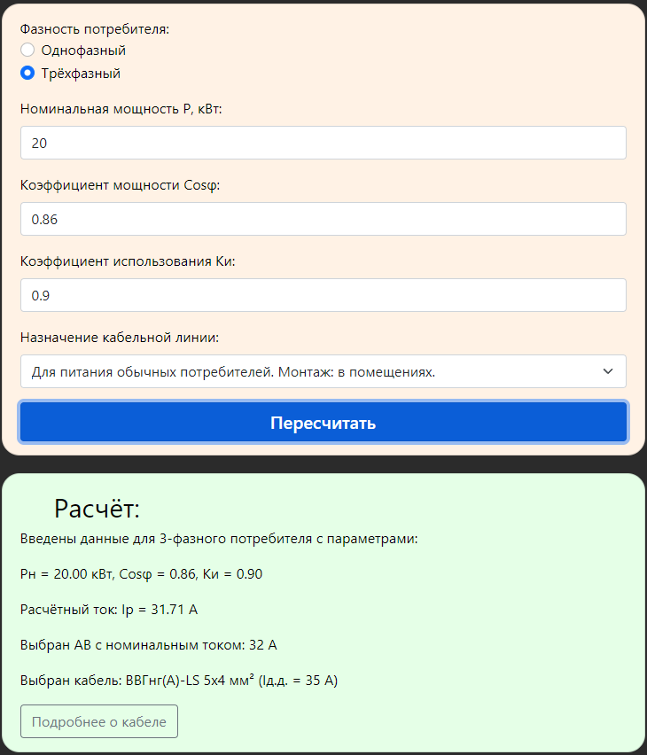

<h3>Калькулятор для расчёта параметров эл. линии.<h3>
<h3><a href="https://igoromashov.github.io/electro-calc/">Запустить</a><h3>

<h3>Дисклеймер:</h3>
  Это мой первый учебный проект. 
  Навигация по навбару отключена намеренно. 
  На момент написания данного проекта я не знал о React, Модулях, Классах и многом другом. 
  В проекте используются стили Bootstrap и некоторые собственные. 
  В проекте можно встретить имена переменных в стиле PascalCase (о классах тогда не думал). 

<h3>Возможности программы:</h3>
<ul>
  <li>Получение исходных данных в ограниченном диапазоне (запрет ввода невалидных данных)</li>
  <li>Расчёт потребляемого тока</li>
  <li>Выбор сечения кабельной линии</li>
  <li>Выбор автоматического выключателя защиты кабельной линии</li>
  <li>Выпор типа кабеля в зависимости от выбора метода монтажа</li>
  <li>Формирование ссылки на сайт с информацией о конкретном кабеле</li>
</ul>

<h3>Реализация в HTML:</h3>
<ul>
  <li>Фавикон сгенерирован на https://favicon.io/</li>
  <li>Логотип в навбаре сгенерирован на https://maketext.io/ и отредактирован на Photoshop</li>
  <li>Навигация по навбару отключена намеренно для разделения проектов, навбар решил не удалять, ссылки на github не встраивать</li>
  <li>Разметка HTML классическая (ничего особенного)</li>
  <li>В HTML импортированы bootstrap и jquery (стили и скрипты)</li>
  <li>Собственные стили прописаны в HTML, инлайн стили практически не используются</li>
</ul>

<h3>Реализация в JavaScript:</h3>
<ul>
  <li>Заданы константы: табличные данные, типовые наименования кабелей, референсы для конструирования ссылов</li>
  <li>Доступ к DOM элементам получается через querySelector по id элемента</li>
  <li>Прописаны функции для ограничения ввода невалидных данных</li>
  <li>Реализованы тривиальные оперции по расчёту и условному ветвлению</li>
  <li>Результаты расчётов передаются в HTML путём обращения к DOM элементам и записи строк в textContent</li>
  <li>Ссылка на информацию о кабеле формируется напрямую в href кнопки</li>
  <li>Часть нереализованного функционала закоментирована</li>
</ul>

<h3>Демонстрация работы калькулятора:</h3>

  
<h3>Баги:</h3>
<ul>
  <li>Возможно ввести в input 00000.1</li>
  <li>Проблематично поставить запятую</li>
</ul>
  
<h3>Статус проекта - завершён, исправление багов не планируется</h3>
  
